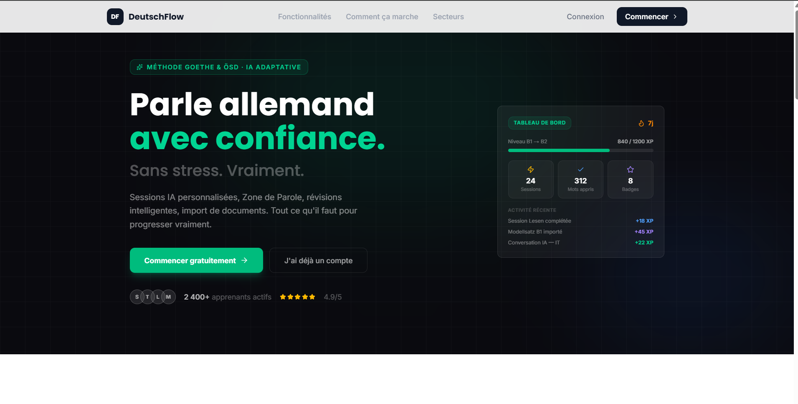

# DeutschFlow

> An AI-powered German learning platform built for French speakers — structured around the ÖSD/Goethe exam format, spaced repetition, and adaptive exercises.



---

## Overview

DeutschFlow is a full-stack language learning application that turns passive study into an active, exam-ready experience. It imports real PDF documents (exercise books, Modellsatz exams, grammar guides), extracts their content using AI vision, and transforms them into interactive exercises. A built-in spaced repetition engine (SM-2), gamification layer, and speaking practice module complete the learning loop.

---

## Features

### PDF Import & AI Extraction
- Upload any German learning PDF (exercises, Modellsatz, grammar books)
- Claude AI reads the PDF as base64 — no text extraction needed, works on scanned documents
- Background processing via **Inngest** to avoid server timeouts
- Three document types handled differently:
  - **Exercises** — extracted + supplementary AI-generated exercises in the same style
  - **Modellsatz** — full ÖSD exam structure preserved (Lesen, Schreiben, Hören, Sprechen, Grammatik) with per-exercise countdown timers
  - **Grammar** — structured into chapters with rules (German + French), examples with TTS, tips, and practice exercises

### Adaptive Learning Sessions
- AI generates personalized exercise sessions using **Claude** based on your CEFR level, sector, and weak skills
- SM-2 spaced repetition algorithm tracks performance per skill
- Lacune detection — skills with low scores get more weight in the next session
- Session state persisted in DB + Zustand (localStorage) — resume after page refresh
- XP and streak updated on session completion
- Badge check triggered automatically after each session

### Exercise Engine
- 20+ exercise types rendered natively:
  - Multiple Choice, True/False, Fill-in-the-Blank, Flashcard, Matching, Sentence Builder
  - Writing with AI correction and model answer
  - Speaking (Web Speech API, `de-DE`) with evaluation
  - Listening (TTS via `/api/tts`)
  - ÖSD-specific: `MatchingHeadlines`, `MultipleChoiceReading`, `SituationAdMatching`, `OsdLueckentext`, `SchreibenOsd`, `GrammatikTransformation`, `Fehlerkorrektur`, `Reihenfolge`
- `sanitizeContent()` normalizes bilingual `{DE, FR}` objects to strings before rendering
- `normalizeType()` / `normalizeSkill()` map 40+ AI-generated type aliases to canonical enum values

### Spaced Repetition Review
- Due exercises regenerated by AI (new content, same type/skill/level) — never the same question twice
- SM-2 entries created after each learn session
- Per-skill score breakdown on results screen

### Vocabulary
- AI-generated word cards with varied topics per session
- Detail page: German definition, French translation, 10 example sentences with TTS, synonyms, antonyms, SM-2 metadata
- Word detail cached in DB (`word_detail_cache`) to avoid redundant AI calls

### Speaking Practice (Zone de Parole)
- AI-generated conversation scenarios cached per user (`speak_scenario` table)
- Chat interface with STT (Web Speech API `de-DE`) and TTS for AI responses
- Scenario evaluation: score, corrections, useful phrases
- "Generate more" adds 5 new scenarios on demand

### Gamification
- **XP system** — earned on exercise completion, streak bonuses, badge awards
- **Streak tracking** — daily calendar heatmap, 30-day bar chart, XP history
- **13 badges** across 4 categories (Streak, XP, Milestone, Skill) — checked and awarded automatically
- **Weekly league** — XP ranking reset every Monday, podium top 3, rank delta vs previous week
- **Public profiles** — view any league member's progress: level bar, 30-day activity grid (GitHub-style), badge showcase

### Community Sharing
- Publish imported documents (exercises, Modellsatz, grammar) to the community
- Confirmation modal with a level-appropriate German message (A0 = simple, C2 = formal)
- Community feed filtered by CEFR level (defaults to your own level), document type, search, pagination
- Copy any public import into your own library

### Onboarding
- 5-step wizard: CEFR level selection, learning goal, professional sector, daily rhythm, recap
- Saved to DB via server action, redirects to dashboard

### Settings
- Update display name, email, CEFR level, sector, goal, daily rhythm
- Sonner toasts on save

---

## Tech Stack

| Layer | Technology |
|---|---|
| Framework | Next.js 16.2 (App Router, React 19) |
| Language | TypeScript 5 |
| Styling | Tailwind CSS 4 |
| UI Components | Shadcn UI (base-ui variant) + Lucide React + React Icons |
| Animations | Framer Motion 12 |
| Database | Neon Postgres (serverless) |
| ORM | Drizzle ORM 0.45 |
| Auth | BetterAuth 1.6 |
| AI | Anthropic Claude (via `@anthropic-ai/sdk`) |
| Background Jobs | Inngest 4 |
| State Management | Zustand 5 (with persist middleware) |
| Forms | React Hook Form 7 + Zod 4 |
| JSON Repair | `@edwinfom/ai-guard` (jsonrepair wrapper) |
| TTS | Web Speech API + `/api/tts` route |
| STT | Web Speech API (`de-DE`) |

---

## Architecture

```
src/
├── app/                          # Next.js App Router
│   ├── (auth)/                   # Login, Register — requireGuest()
│   ├── (dashboard)/              # Protected routes — requireAuth()
│   │   ├── dashboard/            # Main dashboard
│   │   ├── learn/                # AI learning sessions
│   │   ├── review/               # Spaced repetition review
│   │   ├── vocabulary/           # Word cards + detail pages
│   │   ├── speak/                # Speaking practice
│   │   ├── import/               # PDF import + sub-pages
│   │   │   ├── exercises/
│   │   │   ├── modellsatz/
│   │   │   ├── grammar/
│   │   │   └── community/
│   │   ├── badges/               # Badge collection
│   │   ├── streak/               # Streak + XP history
│   │   ├── league/               # Weekly ranking
│   │   │   └── [userId]/         # Public user profile
│   │   ├── analytics/
│   │   ├── chat/
│   │   └── settings/
│   ├── api/
│   │   ├── auth/[...all]/        # BetterAuth handler
│   │   ├── exercises/evaluate-writing/
│   │   ├── import/upload/        # PDF upload → base64 → Inngest
│   │   ├── inngest/              # Inngest event handler
│   │   └── tts/                  # Text-to-speech proxy
│   └── onboarding/
│
├── modules/                      # Feature modules (co-located logic)
│   ├── auth/
│   ├── chat/
│   ├── exercises/
│   │   └── components/renderers/ # One file per exercise type
│   │       └── osd/              # ÖSD-specific renderers
│   ├── gamification/
│   ├── import/
│   ├── learn/
│   ├── onboarding/
│   ├── profile/
│   └── speak/
│
├── lib/
│   ├── ai/
│   │   ├── client.ts             # Anthropic client singleton
│   │   ├── exercise-generator.ts # Session + review generation prompts
│   │   ├── normalize.ts          # Type/skill alias normalization
│   │   └── parse.ts              # parseAIJson() with jsonrepair
│   ├── db/
│   │   └── schema/               # Drizzle schema (4 files)
│   ├── inngest/
│   │   ├── client.ts
│   │   └── functions/
│   │       ├── process-document.ts    # PDF → extract → generate exercises
│   │       ├── generate-modellsatz.ts # Generate 2 new Modellsatz from source
│   │       └── word-of-day.ts
│   ├── auth.ts                   # BetterAuth server config
│   ├── auth-client.ts            # BetterAuth client
│   ├── session.ts                # assertAuth() / requireAuth() / requireGuest()
│   ├── sm2.ts                    # SM-2 algorithm implementation
│   └── tts.ts                    # TTS utility
│
├── components/
│   ├── landing/                  # Landing page sections
│   └── ui/                       # Shadcn base-ui components
│
└── types/
    └── index.ts                  # CEFRLevel, Skill, ExerciseContent, etc.
```

### Data Model (key tables)

| Table | Purpose |
|---|---|
| `user_profile` | CEFR level, sector, goal, XP, streak |
| `exercise` | AI-generated session exercises |
| `active_learn_session` | In-progress session (one per user) |
| `spaced_repetition` | SM-2 state per exercise |
| `skill_performance` | Adaptive profile per skill (avg score, weak types) |
| `daily_session` | XP earned per day (streak + league source) |
| `document_import` | Uploaded PDF metadata + processing status |
| `imported_exercise` | Exercises extracted/generated from PDFs |
| `imported_exercise_result` | Results for imported exercises (separate from SM-2) |
| `speak_scenario` | Cached AI conversation scenarios |
| `word_detail_cache` | Cached AI vocabulary details |
| `badge` / `user_badge` | Badge definitions + earned badges |
| `league_member` | Weekly XP ranking entries |
| `streak_history` | Daily streak completion log |
| `xp_event` | XP event log (reason, amount, source) |

---

## Getting Started

### Prerequisites

- Node.js 20+
- A [Neon](https://neon.tech) Postgres database
- An [Anthropic](https://console.anthropic.com) API key
- An [Inngest](https://inngest.com) account (or run dev server locally)

### Installation

```bash
git clone https://github.com/Edwinfom00/deutsch-flow.git
cd deutsch-flow
npm install
```

### Environment Variables

Copy `.env.example` to `.env.local` and fill in:

```env
DATABASE_URL=postgresql://...
BETTER_AUTH_SECRET=...
BETTER_AUTH_URL=http://localhost:3001
ANTHROPIC_API_KEY=sk-ant-...
INNGEST_DEV=1
```

### Database Setup

```bash
npm run db:push        # Push schema to Neon
npm run db:studio      # Open Drizzle Studio (optional)
```

### Development

Run the Next.js dev server and the Inngest dev server in parallel:

```bash
# Terminal 1
npm run dev            # http://localhost:3001

# Terminal 2
npm run inngest        # Inngest dev server
```

---

## Key Design Decisions

**Imported exercises are separate from session exercises.** They live in `imported_exercise` / `imported_exercise_result` tables and never mix with the SM-2 review queue. This keeps the adaptive learning loop clean.

**AI JSON is always repaired.** Every AI response goes through `parseAIJson()` which uses `jsonrepair` under the hood — Claude occasionally produces slightly malformed JSON, especially for long exercise arrays.

**PDF content is sent as base64.** Rather than extracting text first (which loses layout and formatting), the raw base64 is sent directly to Claude's vision API. This works on scanned documents and preserves table/column structure critical for ÖSD exercises.

**Long AI tasks run through Inngest.** Document processing and Modellsatz generation can take 30–90 seconds — well beyond serverless function limits. Inngest handles retries, timeouts, and background execution.

**`sanitizeContent()` is applied at render time.** AI sometimes returns bilingual `{DE, FR}` objects inside exercise fields. Rather than fixing this in every prompt, a recursive sanitizer converts them to strings before passing to React renderers.

---

## License

MIT
